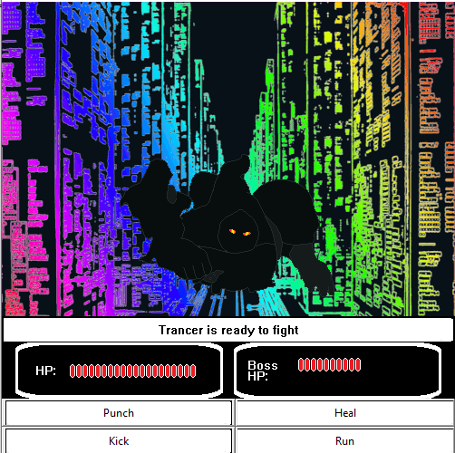

## Resistance 20XX

Resistance 20XX is a short Python-based Role Playing game that was made as a final project for Programming 12 in High School.

> The year is 20XX... The world has been overtaken by Meka Emperor and his army. A radical team of teenagers with attitude have started an uprising. They are known as the Resistance X. The group fed up with the technazis decided to raid and overthrow Meka Emperor. They board the base of Meka Emperer and seek to destroy him.

The game was coded before learning about object-oriented programming or structures, therefore global variables were heavily abused to implement over 40 member attributes for the bosses. Furthermore, the version of Pygame used for the game was not able to animate gifs, therefore animations were implemented by manually switching out each image every 1/60th of a second. The final result of these constrictions is 500 lines of code dedicated strictly to the instantiation of variables and 200 lines towards specialized functions dedicated to each boss fight.

Looking back, its clear that this project was a really unoptimized, sloppy, mess of code, but I do feel that I did pretty well given the knowledge constraints I had to work around at the time. 
